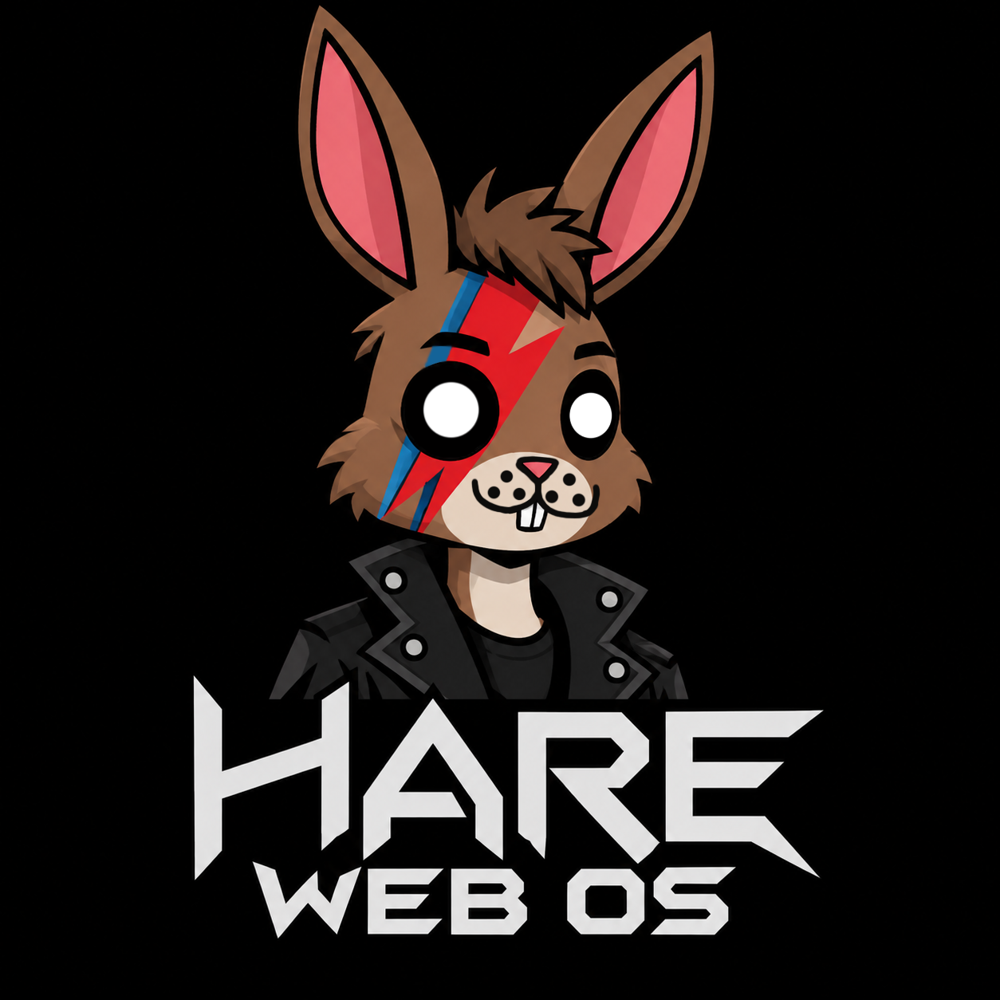

<div align="center">
  
</div>

# HARE WEB OS

**[ Leia em Português abaixo / Read in Portuguese below ]**

HARE WEB OS is a fork of Bunny OS, deeply re-engineered as a modern, high-tech Web Operating System that aims to bring a premium, native desktop experience directly into the browser. 

We have adopted the **Hare** programming language for the kernel to complete the rhyme (replacing Python) alongside a cutting-edge **TypeScript / React** graphical user interface.

---

## 🌟 GNOME 40+ Interface Inspiration

To create a truly spatial, dynamic, and modern user experience, the entire graphical interface and window management system of HARE WEB OS has been deeply inspired by **GNOME 40+**. We have effectively reverse-engineered GNOME's core interaction paradigms from scratch using pure React and CSS math. 

Features inspired by GNOME include:
- **The "Activities" Overview:** The desktop seamlessly zooms out (`scale(0.7)`) into an interactive, spatial carousel of live workspaces.
- **Fluid Workspace Navigation:** Workspaces are arranged horizontally and can be navigated via the overview with pixel-perfect centering math.
- **Cross-Workspace Drag-and-Drop:** You can seamlessly drag active windows from one workspace and drop them into an adjacent workspace while in the Overview.
- **Unified App Grid:** A centered, polished application launcher grid that slides up smoothly, paired with a global search bar.
- **Nautilus-style Files App:** The file manager features a dedicated sidebar for standard Linux directories (`Downloads`, `Documents`, etc.), providing a native management feel.

---

## 🧠 Hybrid Kernel Architecture (Node + WASM)

The OS kernel acts as a dispatch chain over up to three engines. Each command is routed to the first host that supports it, falling back down the chain gracefully:

1. **Native HARE** (`src/kernel/ha/kernel.ha`) — The real Hare kernel, built with `hare build` and spawned by Node under `bin/hare-kernel`. It activates when running under a Node/Electron environment with the binary present.
2. **WASM** (`public/kernel.wasm`) — A zero-import WebAssembly core built from `src/kernel/wasm/kernel.c` via `npm run kernel:wasm`. Since the Hare compiler currently lacks a stable WASM backend, this C module mirrors the HARE ABI. It serves as a drop-in swap point for a real `.ha → .wasm` build once the Hare toolchain matures.
3. **JS Fallback** — The in-browser TypeScript bridge maintains the exact same API, ensuring that every command and feature works flawlessly in any standard web browser, without requiring native execution.

### Virtual File System (VFS)
HARE WEB OS comes with a fully functional Virtual File System running entirely in the browser. It features:
- **Persistent Storage:** Powered by IndexedDB, surviving page reloads.
- **Standard Linux Structure:** Automatically provisions `/workspace/hare-user` and standard directories (`Desktop`, `Downloads`, `Pictures`, etc.) on the first boot.
- **Deep App Integration:** Used by the Terminal, the Code Editor, and the Nautilus-style Files App.

---

## 🛠️ Stack & Technologies

- **Frontend / GUI:** React, TypeScript, Vite
- **Window Manager:** Custom built spatial engine with 3D CSS transforms and drag-and-drop mechanics.
- **Kernel Language:** Hare (native + ABI reference), C shim for the WASM target, TypeScript for the JS bridge.
- **Styling:** Brutalist B&W CSS with dynamic glassmorphism and modern UI tokens.

---

## 🚀 Development & Build

```bash
# Install all dependencies
npm install

# Build the kernel modules
npm run kernel:wasm    # clang → public/kernel.wasm (no toolchain required)
npm run kernel:build   # hare → bin/hare-kernel (or C stand-in if Hare is not installed)
npm run kernel:all     # Build both native and WASM kernels

# Start the Web OS locally
npm run dev
```

---
---

<div align="center">
  <h2>🇧🇷 Versão em Português</h2>
</div>

# HARE WEB OS

O HARE WEB OS é um fork do Bunny OS, profundamente reescrito e reprojetado para ser um Sistema Operacional Web moderno e de alta tecnologia, com o objetivo de trazer uma experiência de desktop nativa e premium diretamente para o seu navegador.

Adotamos a linguagem de programação **Hare** para o kernel (substituindo o Python para completar a rima com "Bunny"), trabalhando em conjunto com uma interface gráfica de ponta feita em **TypeScript / React**.

---

## 🌟 Inspiração na Interface do GNOME 40+

Para criar uma experiência de usuário verdadeiramente espacial, dinâmica e moderna, toda a interface gráfica e o sistema de gerenciamento de janelas do HARE WEB OS foram profundamente inspirados no **GNOME 40+**. Nós efetivamente fizemos uma engenharia reversa dos principais paradigmas de interação do GNOME, recriando tudo do zero usando React puro e matemática no CSS.

Recursos inspirados no GNOME incluem:
- **Visão Geral "Atividades" (Overview):** O desktop afasta o zoom suavemente (`scale(0.7)`) e se transforma em um carrossel espacial e interativo de áreas de trabalho (workspaces) ativas.
- **Navegação Fluida de Workspaces:** As áreas de trabalho são organizadas horizontalmente e podem ser navegadas na Visão Geral com uma centralização milimétrica e física realista.
- **Arrastar e Soltar (Drag-and-Drop) entre Workspaces:** Você pode arrastar janelas ativas de uma área de trabalho e soltá-las em outra área de trabalho vizinha enquanto estiver na tela de Atividades.
- **Grade de Aplicativos Unificada:** Um menu de aplicativos centralizado e polido que desliza para cima, acompanhado por uma barra de pesquisa global.
- **FilesApp no Estilo Nautilus:** O gerenciador de arquivos conta com uma barra lateral dedicada para os diretórios padrões do Linux (`Downloads`, `Documentos`, `Imagens`, etc.), proporcionando uma sensação nativa e robusta de gerenciamento.

---

## 🧠 Arquitetura de Kernel Híbrido (Node + WASM)

O kernel do SO atua como uma cadeia de despacho operando em até três motores. Cada comando é roteado para o primeiro host que o suporta, caindo para as alternativas seguintes de forma invisível:

1. **HARE Nativo** (`src/kernel/ha/kernel.ha`) — O verdadeiro kernel Hare, compilado com `hare build` e executado pelo Node em `bin/hare-kernel`. Ele é ativado quando o sistema roda em um ambiente Node/Electron com o binário presente.
2. **WASM** (`public/kernel.wasm`) — Um núcleo WebAssembly sem importações construído a partir de `src/kernel/wasm/kernel.c` via `npm run kernel:wasm`. Como o compilador Hare ainda não possui um backend WASM estável, este módulo em C espelha a ABI do HARE. Ele serve como uma ponte de troca direta para uma futura build `.ha → .wasm` quando o compilador Hare amadurecer.
3. **JS Fallback (Alternativa JS)** — A ponte TypeScript que roda no navegador mantém exatamente a mesma API, garantindo que todos os comandos e recursos funcionem perfeitamente em qualquer navegador web padrão, sem exigir execução nativa.

### Sistema de Arquivos Virtual (VFS)
O HARE WEB OS vem com um Sistema de Arquivos Virtual totalmente funcional rodando 100% no navegador. Ele conta com:
- **Armazenamento Persistente:** Alimentado pelo IndexedDB, os arquivos sobrevivem ao recarregar a página.
- **Estrutura Padrão Linux:** Provisiona automaticamente a pasta `/workspace/hare-user` e os diretórios padrões (`Área de trabalho`, `Downloads`, `Imagens`, etc.) na primeira inicialização.
- **Integração Profunda com os Apps:** Utilizado pelo Terminal, pelo Editor de Código e pelo Gerenciador de Arquivos estilo Nautilus.

---

## 🛠️ Tecnologias Utilizadas

- **Frontend / Interface Gráfica:** React, TypeScript, Vite
- **Gerenciador de Janelas:** Motor espacial customizado com transformações CSS 3D e mecânicas de arrastar e soltar.
- **Linguagem do Kernel:** Hare (nativo + referência ABI), C shim para a versão WASM, TypeScript para a ponte no navegador JS.
- **Estilo:** CSS Brutalista P&B, turbinado com glassmorphism dinâmico e tokens de UI modernos.

---

## 🚀 Como Desenvolver e Rodar

```bash
# Instale todas as dependências
npm install

# Compile os módulos do kernel
npm run kernel:wasm    # clang → public/kernel.wasm (não precisa do Hare instalado)
npm run kernel:build   # hare → bin/hare-kernel (ou alternativa em C se o Hare não estiver instalado)
npm run kernel:all     # Compila ambos (nativo e WASM)

# Inicie o Web OS localmente
npm run dev
```
